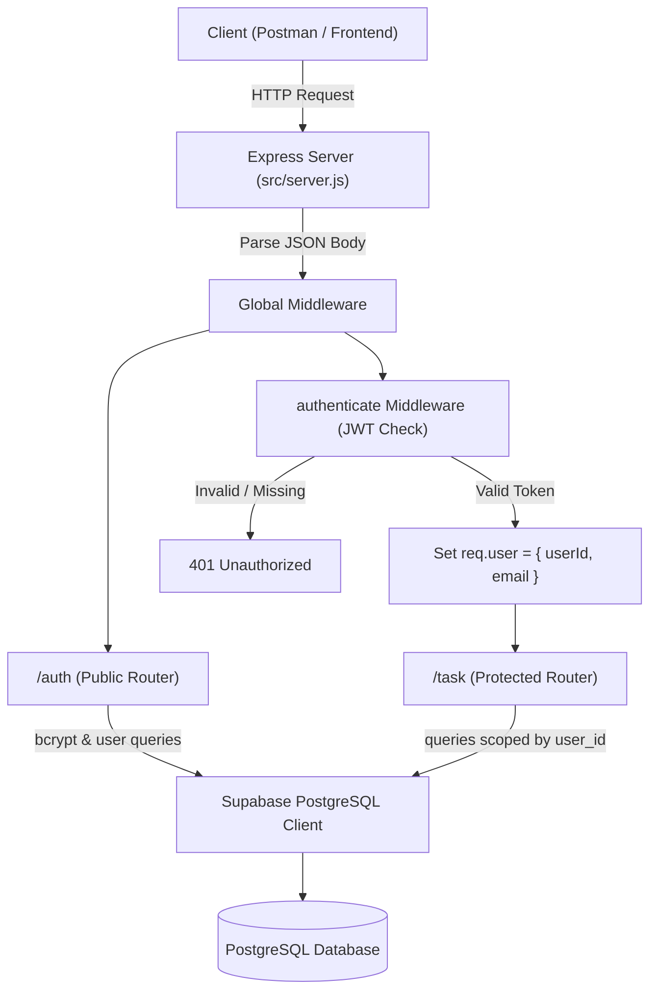

# Task Manager API

A robust RESTful API built with **Node.js**, **Express 5**, **JWT Authentication**, and **Supabase (PostgreSQL)**. This project demonstrates backend architecture concepts including custom stateless authentication, route protection middleware, multi-tenant data isolation, and CRUD operations.

---

## 📌 Table of Contents

- [Overview & Scope](#-overview--scope)
- [Architecture & Request Flow](#-architecture--request-flow)
- [Tech Stack](#-tech-stack)
- [Project Directory Structure](#-project-directory-structure)
- [Database Schema (Supabase / PostgreSQL)](#-database-schema-supabase--postgresql)
- [Environment Variables](#-environment-variables)
- [Getting Started](#-getting-started)
- [API Reference](#-api-reference)
  - [Authentication Routes](#authentication-routes)
  - [Task Routes (Protected)](#task-routes-protected)
- [Security & Authorization Principles](#-security--authorization-principles)
- [Future Scope & Enhancements](#-future-scope--enhancements)

---

## 🎯 Overview & Scope

The purpose of this project is to implement a complete, secure REST API backend from scratch without relying on third-party managed Auth SDKs on the server:
- **Authentication**: Custom authentication using salted bcrypt password hashing and signed JSON Web Tokens (JWT).
- **Authorization & Data Isolation**: Strict user-level scoping ensuring that authenticated users can only create, view, update, and delete their own tasks.
- **Database**: Direct integration with Supabase PostgreSQL tables using `@supabase/supabase-js`.
- **Modularity**: Separation of concerns between entry server configuration, routing layers, custom authentication middleware, and database clients.

---

## 🏗 Architecture & Request Flow



---

## 🛠 Tech Stack

- **Runtime**: [Node.js](https://nodejs.org/) (ES Modules enabled via `"type": "module"`)
- **Web Framework**: [Express 5](https://expressjs.com/)
- **Database & Storage**: [Supabase](https://supabase.com/) (PostgreSQL)
- **Authentication & Security**:
  - [jsonwebtoken (JWT)](https://github.com/auth0/node-jsonwebtoken) for token generation and verification
  - [bcrypt](https://github.com/kelektiv/node.bcrypt.js) for password hashing and salting
- **Configuration**: [dotenv](https://github.com/motdotla/dotenv) for environment variable management

---

## 📁 Project Directory Structure

```text
task-api/
├── middleware/
│   └── authenticate.js       # JWT validation middleware; injects req.user
├── src/
│   ├── routes/
│   │   ├── auth.js           # Public auth routes: /auth/register, /auth/login
│   │   └── task.js           # Protected task routes: CRUD operations for tasks
│   └── server.js             # Express app setup, middleware mounts, and server entry point
├── util/
│   └── db/
│       └── supabaseClient.js # Supabase client initialization
├── .env                      # Environment configurations (ignored in git)
├── .env.example              # Example environment variable template
├── .gitignore                # Git ignore patterns for dependencies & secrets
├── goal.md                   # Project requirements and testing checklist
├── package.json              # Project scripts and dependencies
└── README.md                 # Project documentation and developer reference
```

---

## 🗄 Database Schema (Supabase / PostgreSQL)

Run the following SQL queries in your Supabase SQL editor to create the required tables:

```sql
-- 1. Users Table
CREATE TABLE users (
  id UUID PRIMARY KEY DEFAULT gen_random_uuid(),
  name TEXT NOT NULL,
  email TEXT UNIQUE NOT NULL,
  password TEXT NOT NULL,
  created_at TIMESTAMPTZ DEFAULT NOW()
);

-- 2. Tasks Table
CREATE TABLE tasks (
  id UUID PRIMARY KEY DEFAULT gen_random_uuid(),
  user_id UUID NOT NULL REFERENCES users(id) ON DELETE CASCADE,
  title TEXT NOT NULL,
  description TEXT,
  completed BOOLEAN DEFAULT FALSE,
  created_at TIMESTAMPTZ DEFAULT NOW(),
  updated_at TIMESTAMPTZ DEFAULT NOW()
);

-- Index for faster task queries by user
CREATE INDEX idx_tasks_user_id ON tasks(user_id);
```

---

## ⚙️ Environment Variables

Create a `.env` file in the project root based on the following variables:

```env
# Server
EXPRESS_PORT=3000

# Security
JWT_SECRET_KEY=your_super_secret_jwt_key
PW_SALTS=10

# Supabase
SUPABASE_URL=https://your-project.supabase.co
SUPABASE_SECRET_KEY=your-supabase-service-or-anon-key
```

> [!WARNING]
> Never commit your `.env` file or sensitive keys into version control.

---

## 🚀 Getting Started

### 1. Prerequisites
- Node.js (v18+ recommended)
- A configured Supabase project

### 2. Installation
```bash
git clone <repo-url>
cd task-api
npm install
```

### 3. Run the Server
- **Production mode:**
  ```bash
  node src/server.js
  ```
- **Development mode:**
  ```bash
  npm run dev
  ```
The server will start at `http://localhost:3000`.

---

## 📖 API Reference

### Authentication Routes

#### 1. Register User
- **Method**: `POST`
- **Endpoint**: `/auth/register`
- **Access**: Public
- **Body**:
  ```json
  {
    "name": "Rahul",
    "email": "rahul@example.com",
    "password": "strongPassword123"
  }
  ```
- **Responses**:
  - `201 Created`: User created successfully
  - `500 Internal Server Error`: Registration failed

---

#### 2. User Login
- **Method**: `POST`
- **Endpoint**: `/auth/login`
- **Access**: Public
- **Body**:
  ```json
  {
    "email": "rahul@example.com",
    "password": "strongPassword123"
  }
  ```
- **Responses**:
  - `201 Created`:
    ```json
    {
      "message": "user logged in",
      "token": "eyJhbGciOi..."
    }
    ```
  - `401 Unauthorized`: Invalid credentials

---

### Task Routes (Protected)

> **Authentication Required**: Include the JWT token in the HTTP Authorization header:
> ```text
> Authorization: Bearer <your_jwt_token>
> ```

#### 1. Get All My Tasks
- **Method**: `GET`
- **Endpoint**: `/task`
- **Description**: Returns all tasks that belong to the authenticated user.
- **Response `200 OK`**:
  ```json
  [
    {
      "id": "c1f7b022-...",
      "user_id": "84e5a9b7-...",
      "title": "Complete Documentation",
      "description": "Write comprehensive README",
      "completed": false,
      "created_at": "2026-10-04T12:00:00.000Z",
      "updated_at": "2026-10-04T12:00:00.000Z"
    }
  ]
  ```

---

#### 2. Create Task
- **Method**: `POST`
- **Endpoint**: `/task`
- **Body**:
  ```json
  {
    "title": "Complete Documentation",
    "description": "Write comprehensive README",
    "completed": false
  }
  ```
- **Response `201 Created`**:
  ```json
  {
    "message": "Task Created Successfully"
  }
  ```

---

#### 3. Get Single Task
- **Method**: `GET`
- **Endpoint**: `/task/:id`
- **Response `200 OK`**: Task object
- **Response `400 Bad Request` / `404 Not Found`**: Task does not exist or user is unauthorized.

---

#### 4. Update Task
- **Method**: `PATCH`
- **Endpoint**: `/task/:id`
- **Body** *(partial update)*:
  ```json
  {
    "completed": true
  }
  ```
- **Response `200 OK`**:
  ```json
  {
    "message": "Task updated successfully"
  }
  ```

---

#### 5. Delete Task
- **Method**: `DELETE`
- **Endpoint**: `/task/:id`
- **Response `200 OK`**:
  ```json
  {
    "message": "Task deleted successfully"
  }
  ```

---

## 🔒 Security & Authorization Principles

1. **Password Protection**: Passwords are never saved in plaintext; bcrypt salt rounds are applied before persisting users to Supabase.
2. **Stateless Authorization via JWT**: Protected routes rely on extracting `userId` from the verified token payload attached by [authenticate.js](file:///home/mr-talukdar/Documents/express/task-api/middleware/authenticate.js).
3. **No User Impersonation**: Clients cannot specify `user_id` in request payloads. The API always derives the user context from `req.user.userId`.
4. **Tenant Isolation**: Every database operation on `/task` explicitly verifies that records match both `id` and `user_id`.

---

## 🔮 Future Scope & Enhancements

- [ ] **Request Validation**: Integrate schema validation (e.g., `zod` or `joi`) for incoming requests.
- [ ] **Controller Layer Refactor**: Extract route handlers into dedicated controller files (`controllers/task.controller.js`).
- [ ] **Query Filtering & Pagination**: Support `GET /task?completed=true&page=1&limit=10`.
- [ ] **Search & Sort**: Add search by task title/description and sort by creation date.
- [ ] **Centralized Error Handling**: Implement an Express global error-handling middleware function `(err, req, res, next)`.
- [ ] **Automated Testing**: Add unit and integration tests using Jest or Vitest with Supertest.
